# 🚀 Intelligent Job Search Automation Workflow

An advanced n8n-powered automation system that streamlines the job search process by automatically discovering, analyzing, and processing job opportunities with AI-driven insights and personalized content generation.

## 📋 Table of Contents
- [Overview](#overview)
- [Workflow Architecture](#workflow-architecture)
- [Detailed Process Flow](#detailed-process-flow)
- [Components & Technologies](#components--technologies)
- [Setup & Configuration](#setup--configuration)
- [Output & Results](#output--results)
- [Future Improvements](#future-improvements)

## 🎯 Overview

This automation workflow revolutionizes the job search process by:
- **Automatically discovering** new job postings from RSS feeds
- **Intelligently scoring** job compatibility based on candidate skills
- **Generating personalized** cover letters for each opportunity
- **Organizing results** in a structured Google Sheets database
- **Running scheduled** daily checks to ensure no opportunities are missed

The system operates completely autonomously, requiring minimal manual intervention while providing maximum value through AI-powered analysis and content generation.

## 🏗️ Workflow Architecture

```mermaid
graph LR
    A[Schedule Trigger] --> B[RSS Feed Reader]
    B --> C[Limit Filter]
    C --> D[HTTP Request]
    D --> E[Job Parser AI]
    E --> F[Compatibility Scorer AI]
    F --> G[Cover Letter Generator AI]
    G --> H[Google Sheets Logger]
    
    style A fill:#e1f5fe
    style E fill:#f3e5f5
    style F fill:#f3e5f5
    style G fill:#f3e5f5
    style H fill:#e8f5e8
```

## 🔄 Detailed Process Flow

### 1. **Scheduled Trigger** ⏰
- **Frequency**: Daily at 12:00 PM
- **Purpose**: Initiates the entire workflow automatically
- **Reliability**: Ensures consistent job discovery without manual intervention

### 2. **RSS Feed Processing** 📡
- **Source**: LinkedIn job postings RSS feed (`https://rss.app/feeds/a8Tg1pSMYPgOOSSC.xml`)
- **Function**: Fetches latest job postings in real-time
- **Data Extracted**: Job titles, descriptions, company information, posting URLs

### 3. **Intelligent Filtering** 🎯
- **Limit Control**: Processes a manageable number of jobs per run
- **Purpose**: Prevents API rate limiting and ensures quality over quantity
- **Efficiency**: Focuses resources on the most recent opportunities

### 4. **Job Content Enrichment** 🌐
- **HTTP Requests**: Fetches complete job posting details from original URLs
- **Data Enhancement**: Retrieves full job descriptions, requirements, and company details
- **Context Building**: Gathers comprehensive information for AI analysis

### 5. **AI-Powered Job Parsing** 🤖
- **Model**: GPT-4O-Mini
- **Function**: Extracts and structures key job information
- **Output**: Standardized JSON format containing:
  - Company name
  - Job title
  - Location details
  - Comprehensive job description
  - Required qualifications

### 6. **Intelligent Compatibility Scoring** 📊
- **Scoring System**: 5-point scale based on multiple criteria:
  - **Skills Matching** (3 points): Direct alignment with candidate's technical skills
  - **Experience Level** (1 point): Appropriate seniority level match
  - **Remote Flexibility** (1 point): Location compatibility assessment
  - **Past Experience Relevance** (1 point): Historical role alignment
  - **Qualification Alignment** (3 points): Overall qualification fit

### 7. **Personalized Cover Letter Generation** ✍️
- **AI Writer**: Professional cover letter creation using GPT-4O-Mini
- **Customization**: Tailored to specific job requirements and candidate profile
- **Quality**: Honest, effective, and professionally structured content
- **Efficiency**: Eliminates hours of manual writing per application

### 8. **Automated Data Management** 📈
- **Storage**: Google Sheets integration for organized job tracking
- **Structure**: Systematic recording of all processed jobs
- **Accessibility**: Easy review and management of opportunities
- **History**: Maintains comprehensive application history

## 🛠️ Components & Technologies

### Core Platforms
- **n8n**: Workflow orchestration and automation
- **OpenAI GPT-4O-Mini**: AI analysis and content generation
- **Google Sheets**: Data storage and organization
- **RSS.app**: Job feed aggregation

### Key Features
- **Scheduled Automation**: Zero manual intervention required
- **AI-Driven Analysis**: Intelligent job matching and scoring
- **Content Generation**: Personalized cover letter creation
- **Data Organization**: Structured storage and tracking
- **Scalable Architecture**: Easily adaptable to additional job sources

### Integration Points
- **RSS Feed Integration**: Real-time job discovery
- **OpenAI API**: Advanced language model capabilities
- **Google Sheets API**: Seamless data storage
- **HTTP Requests**: Dynamic content fetching

## ⚙️ Setup & Configuration

### Prerequisites
- n8n instance (cloud or self-hosted)
- OpenAI API access with GPT-4O-Mini availability
- Google Sheets with API credentials
- RSS feed URL for job postings

### Configuration Steps
1. **Import Workflow**: Load the `JobSearch_n8n.json` file into your n8n instance
2. **API Credentials**: Configure OpenAI and Google Sheets authentication
3. **Schedule Setup**: Adjust trigger timing based on your preferences
4. **Candidate Profile**: Update the embedded resume/profile information
5. **Output Sheet**: Configure the target Google Sheets document
6. **RSS Source**: Customize job sources as needed

## 📊 Output & Results

### Google Sheets Structure
The automation populates a comprehensive spreadsheet with:
- **Job Title**: Position name and company
- **Compatibility Score**: AI-generated 1-5 rating
- **Job Details**: Location, requirements, description
- **Cover Letter**: Personalized application content
- **Processing Date**: Timestamp for tracking
- **Source URL**: Original job posting link

### Performance Metrics
- **Daily Processing**: 10-50 jobs analyzed automatically
- **Time Savings**: 2-3 hours of manual work eliminated daily
- **Quality Scoring**: Consistent, objective job evaluation
- **Application Ready**: Immediate access to personalized cover letters

## 🚀 Future Improvements

I'm currently in the process of implementing several exciting enhancements to make this workflow even more powerful and intelligent:

### 🎯 Enhanced Intelligence Layer
- **Multi-Model Analysis**: Integrating Claude 3.5 Sonnet for comparative analysis and more nuanced job matching
- **Advanced Scoring Algorithm**: Developing a weighted scoring system that considers company culture fit, growth potential, and career trajectory alignment
- **Salary Intelligence**: Adding compensation analysis and market rate comparisons using real-time salary data APIs

### 🔗 Expanded Integration Ecosystem
- **Multi-Platform Support**: Currently adding Indeed, Glassdoor, and AngelList RSS feeds for comprehensive job coverage
- **CRM Integration**: Building connections to personal CRM systems (Notion, Airtable) for advanced opportunity management
- **Calendar Sync**: Implementing automatic interview scheduling and application deadline tracking
- **Email Automation**: Developing follow-up email sequences and application status tracking

### 🤖 Advanced AI Capabilities
- **Resume Optimization**: Working on AI-powered resume tailoring for each specific job application
- **Interview Preparation**: Creating automated interview question generation and practice session scheduling
- **Company Research**: Building comprehensive company analysis including recent news, financial health, and employee sentiment
- **Application Strategy**: Developing AI recommendations for optimal application timing and approach methods

### 📊 Analytics & Insights Dashboard
- **Success Tracking**: Building response rate analytics and application outcome monitoring
- **Market Intelligence**: Creating job market trend analysis and skill demand forecasting
- **Performance Optimization**: Implementing A/B testing for cover letter templates and application strategies
- **Competitive Analysis**: Developing insights into similar candidate profiles and their success rates

### 🔧 Technical Enhancements
- **Error Handling & Reliability**: Implementing robust retry mechanisms and failure notifications
- **Performance Optimization**: Adding caching layers and API rate limiting for improved efficiency
- **Mobile Integration**: Creating mobile app for on-the-go job opportunity management
- **Voice Integration**: Building voice-activated job search updates and opportunity briefings

### 🌐 Networking & Community Features
- **Referral Network**: Developing automated referral opportunity detection and outreach
- **Professional Network Analysis**: Implementing LinkedIn connection analysis for warm introduction opportunities
- **Industry Insights**: Creating automated industry trend reports and networking event recommendations
- **Peer Comparison**: Building anonymous benchmarking against similar profiles in the market

### 📈 Personalization & Learning
- **Machine Learning Pipeline**: Training custom models on personal preferences and successful application patterns
- **Feedback Loop**: Implementing outcome tracking to continuously improve matching algorithms
- **Preference Learning**: Building adaptive systems that learn from user interactions and decisions
- **Career Path Planning**: Developing long-term career trajectory recommendations and skill gap analysis

These improvements are designed to transform this from a simple job aggregation tool into a comprehensive career advancement platform that not only finds opportunities but actively enhances your chances of success in the job market.

---

## 📝 Notes

This workflow represents a significant step toward fully automated job searching, combining the efficiency of automation with the intelligence of modern AI systems. The continuous improvements being implemented will further enhance its capability to serve as a comprehensive career advancement tool.

**Last Updated**: January 2025  
**Version**: 2.0  
**Status**: Active Development with Planned Enhancements
